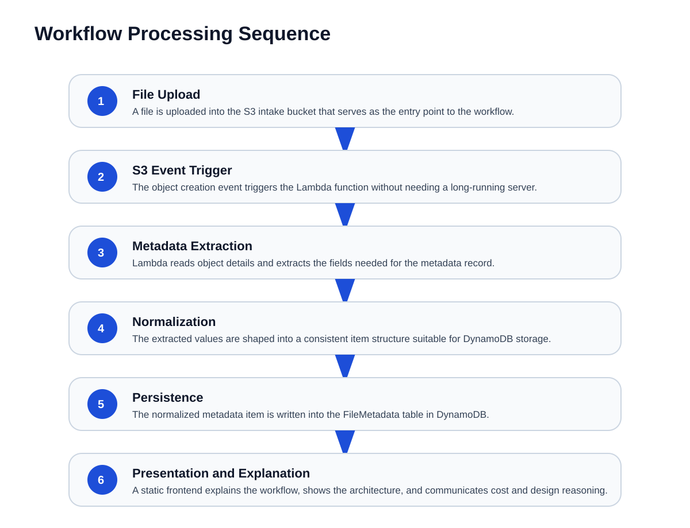
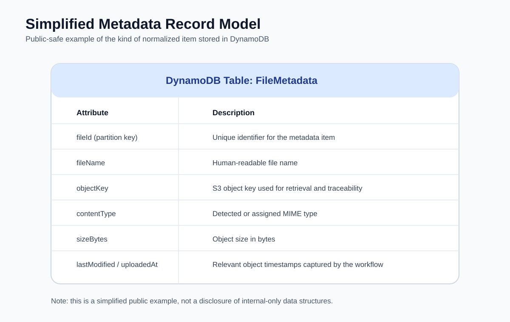

# AWS Serverless Metadata Workflow

A public technical case study documenting the AWS serverless metadata workflow I built during my AWS Support Engineering internship.

This project package is designed to be the public-facing, recruiter-safe version of the work. It explains the problem, architecture, workflow, implementation decisions, security boundaries, cost model, and lessons learned without exposing internal-only details or any production customer information.

## What this project is

- A real AWS internship capstone case study
- A documentation-first public repo
- A GitHub Pages-ready static site
- A technical walkthrough with architecture graphics
- A clear explanation of how the system was built and why

## What this project is not

- Not a dump of confidential internship material
- Not production customer infrastructure
- Not a claim of owning live enterprise systems
- Not a complete productized SaaS application

## Project summary

The workflow was built to automatically extract metadata from uploaded files using AWS serverless services. At a high level:

1. A file is uploaded into Amazon S3.
2. The upload event triggers an AWS Lambda function.
3. Lambda extracts metadata from the object and normalizes it.
4. The metadata is written into a DynamoDB table.
5. A static frontend presents the workflow, results, and cost model in an accessible way.

The public documentation focuses on:

- AWS Lambda
- Amazon S3
- Amazon DynamoDB
- CloudFront or Amplify as the static delivery layer
- CloudWatch-style operational thinking
- Accessibility and technical communication
- A transparent usage-based cost model

## Live documentation site

This repository contains a Pages-ready site in the repository root.

If GitHub Pages is not already enabled, the only manual step is:

- Go to **Settings > Pages**
- Set the source to **Deploy from a branch**
- Choose the **main** branch and the **root** folder

Once enabled, the site will publish from `index.html`.

## Key diagrams

### Architecture overview


### Processing flow



### Data model



## Documentation

- [Architecture](docs/architecture.md)
- [Implementation Notes](docs/implementation-notes.md)
- [Security and Scope Boundaries](docs/security-and-scope.md)
- [Cost Model](docs/cost-model.md)
- [Testing and Validation](docs/testing-and-validation.md)
- [Future Improvements](docs/future-improvements.md)

## Repo structure

```text
.
├── assets/
│   ├── architecture-overview.svg
│   ├── processing-flow.svg
│   └── data-model.svg
├── docs/
│   ├── architecture.md
│   ├── implementation-notes.md
│   ├── security-and-scope.md
│   ├── cost-model.md
│   ├── testing-and-validation.md
│   └── future-improvements.md
├── index.html
├── styles.css
├── .nojekyll
└── README.md
```

## Resume-safe explanation

Built an AWS serverless metadata workflow during an AWS Support Engineering internship using Lambda, DynamoDB, S3, and a static frontend delivery layer, then documented the system with an accessible public case-study site and a transparent usage-based cost model.

## Author

**Bradley Matera**  
Portfolio: https://bradleymatera.dev/recruiter/  
LinkedIn: https://www.linkedin.com/in/bradmatera/
