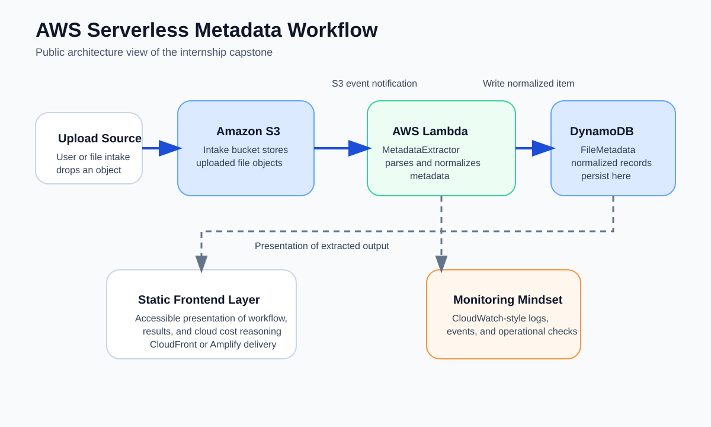
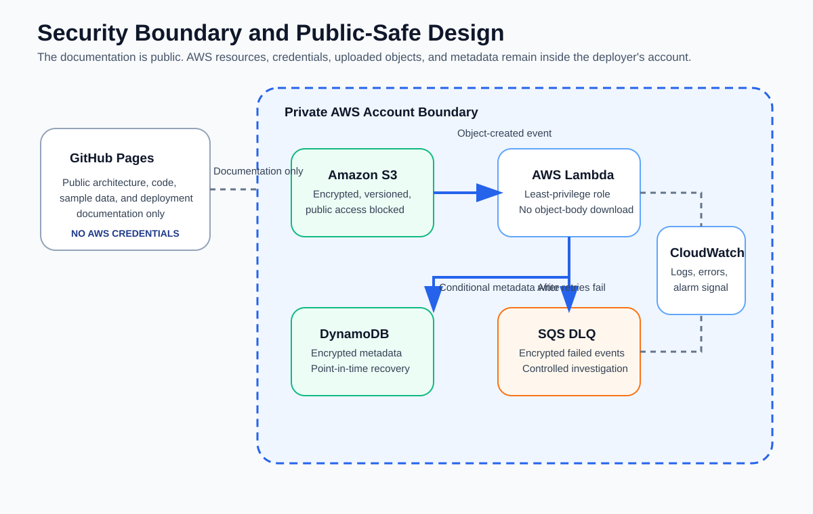
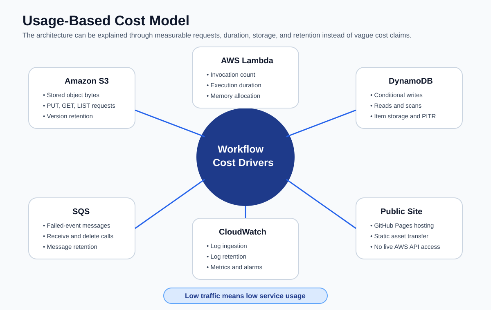

# AWS Serverless Metadata Workflow

[](https://github.com/BradleyMatera/Office/actions/workflows/validate.yml)
[](https://github.com/BradleyMatera/Office/actions/workflows/site-health.yml)
[](https://bradleymatera.github.io/Office/)
[](LICENSE)

An event-driven AWS project that turns Amazon S3 file uploads into normalized DynamoDB metadata records using AWS Lambda.

- **Project site:** https://bradleymatera.github.io/Office/
- **Clean resume link:** https://bradleymatera.dev/aws-metadata-workflow/
- **AWS articles:** https://bradleymatera.github.io/Office/writing.html
- **Project evidence:** https://bradleymatera.github.io/Office/proof.html
- **AWS documentation references:** https://bradleymatera.github.io/Office/sources.html
- **Portfolio:** https://bradleymatera.dev/recruiter/



## How the workflow works

1. A file is uploaded under a configurable Amazon S3 key prefix, defaulting to `incoming/`.
2. S3 sends an object-created notification to AWS Lambda.
3. The Python 3.12 function validates the event, URL-decodes the object key, and calls `HeadObject`.
4. The function normalizes the object metadata into a versioned record.
5. It creates a deterministic SHA-256 `RecordId` from the bucket, decoded key, version ID, and ETag.
6. It writes the record to DynamoDB with `attribute_not_exists(RecordId)` so repeated event delivery is safe.
7. Unexpected failures are raised for Lambda asynchronous retry.
8. Events that still fail are sent to an encrypted SQS failure destination.
9. CloudWatch alarms monitor Lambda errors, throttles, and failed events waiting in the queue.
10. An optional SNS email subscription makes those alarms actionable.

The function reads object headers. It does **not** download or parse the complete file body.

## Original internship project and public implementation

The original workflow was built during my AWS Support Engineering internship in isolated training and project environments. It connected S3, Lambda, DynamoDB, and a static presentation layer and included a usage-based infrastructure cost model.

This repository is a public reconstruction and expansion of that architecture. It does not contain confidential Amazon source files, customer data, production account information, or production support access.

The public implementation adds:

- AWS SAM and CloudFormation infrastructure
- a Python 3.12 Lambda function
- deterministic record identity
- idempotent DynamoDB writes
- asynchronous retries and an encrypted SQS failure destination
- CloudWatch alarms and optional SNS email notifications
- unit tests and coverage enforcement
- deployment, operations, cleanup, and troubleshooting documentation
- a static project site with architecture diagrams and related AWS articles

## Current verification

The August 3, 2026 local audit produced:

- **11 passing tests**
- **100% statement coverage**
- **100% branch coverage**

The CI workflow also runs:

- Python compilation
- Ruff linting across `src`, `tests`, and `scripts`
- Pytest with branch coverage
- static-site validation
- AWS SAM template linting
- AWS SAM application build

A separate scheduled workflow checks the published Pages routes, stylesheets, social image, sitemap, RSS feed, and machine-readable summary.

## Infrastructure

### Amazon S3

- server-side encryption
- versioning
- bucket-owner-enforced object ownership with ACLs disabled
- all four Block Public Access controls
- configurable processing prefix
- incomplete multipart-upload cleanup
- retained-data policy during stack deletion

### AWS Lambda

- Python 3.12 ARM64 runtime
- 256 MB memory and 30-second timeout
- active X-Ray tracing
- version-aware `HeadObject` requests
- structured JSON logs
- one-hour maximum asynchronous event age
- two asynchronous retry attempts
- encrypted SQS on-failure destination

### Amazon DynamoDB

- on-demand billing
- encrypted storage
- deterministic `RecordId` partition key
- conditional idempotent writes
- point-in-time recovery
- retained-data policy during stack deletion

### Operations

- encrypted SQS failure queue
- configurable CloudWatch Logs retention, defaulting to 14 days
- Lambda error alarm
- Lambda throttle alarm
- failure-queue depth alarm
- optional SNS topic and confirmed email subscription
- deployment, recovery, troubleshooting, and cleanup runbooks

## Lambda behavior

The Lambda function:

- validates the S3 event major version
- rejects unsupported event sources and empty record lists
- URL-decodes S3 keys with `unquote_plus`
- sends a version ID to `HeadObject` when present
- normalizes required and optional metadata fields
- stores custom S3 user metadata without logging object contents
- records checksums when S3 supplies them
- creates deterministic SHA-256 identity
- treats a conditional-check failure as a safe duplicate
- aggregates failed record indexes and raises unexpected failures for retry
- lazily creates and reuses AWS SDK clients across warm invocations

## Architecture

```text
Upload under configured prefix
            |
            v
       Amazon S3
            |
       ObjectCreated
            v
       AWS Lambda ---------------> CloudWatch Logs and alarms
            |
        HeadObject
            |
    normalize metadata
            |
 conditional PutItem
            v
    Amazon DynamoDB

Unexpected asynchronous failure
            |
       Lambda retries
            |
            v
 encrypted SQS failure queue ----> queue-depth alarm ----> optional SNS email
```

The GitHub Pages site is separate from any AWS deployment. It contains code, documentation, examples, and diagrams but no AWS credentials and no direct access to uploaded objects or cloud resources.



## Metadata record

The DynamoDB partition key is `RecordId`, a deterministic SHA-256 hash derived from:

- bucket name
- decoded object key
- object version ID, when present
- ETag

Representative item:

```json
{
  "RecordId": "b642d8134b3e...",
  "SchemaVersion": "1",
  "Bucket": "metadata-workflow-uploadbucket-example",
  "ObjectKey": "incoming/quarterly report.pdf",
  "FileName": "quarterly report.pdf",
  "EventName": "ObjectCreated:Put",
  "EventTime": "2026-08-03T18:00:00.000Z",
  "ProcessedAt": "2026-08-03T18:00:01.314Z",
  "SizeBytes": 4096,
  "ContentType": "application/pdf",
  "ETag": "0123456789abcdef0123456789abcdef",
  "LastModified": "2026-08-03T18:00:00Z",
  "StorageClass": "STANDARD",
  "VersionId": "example-version-id",
  "Sequencer": "0066AF001122334455",
  "UserMetadata": {
    "department": "support"
  }
}
```

See [Metadata Data Contract](docs/data-contract.md).

## Run the checks

### Prerequisites

- Python 3.12
- AWS CLI
- AWS SAM CLI
- Docker when a containerized SAM build is required
- authorized AWS credentials for deployment

```bash
make install
make check
```

`make check` runs compilation, linting, tests, static-site validation, SAM validation, and the SAM build.

Individual commands:

```bash
make compile
make lint
make test
make site
make validate
make build
```

## Deploy

```bash
sam deploy --guided \
  --stack-name aws-serverless-metadata-workflow \
  --region us-east-1
```

The guided deployment asks for:

- `InputPrefix`, default `incoming/`
- `LogRetentionDays`, default `14`
- optional `AlarmEmail`

When an email is supplied, the recipient must confirm the SNS subscription before alarm notifications are delivered.

Read the [Deployment Guide](docs/deployment.md) before creating or deleting resources.

## Test a deployed stack

```bash
printf 'metadata workflow test\n' > sample.txt

aws s3 cp sample.txt \
  s3://YOUR_UPLOAD_BUCKET/incoming/sample.txt \
  --content-type text/plain \
  --metadata source=readme
```

Then inspect the function logs and DynamoDB records:

```bash
aws logs tail /aws/lambda/YOUR_FUNCTION_NAME \
  --region us-east-1 \
  --since 10m \
  --follow

aws dynamodb scan \
  --region us-east-1 \
  --table-name YOUR_METADATA_TABLE \
  --max-items 10
```

## Reliability model

### At-least-once event delivery

S3 Event Notifications can be delivered more than once and are not globally ordered. The implementation records the S3 sequencer and uses deterministic identity plus a conditional write rather than assuming exactly-once delivery.

### Idempotency

```text
ConditionExpression = attribute_not_exists(RecordId)
```

A repeated identity returns `duplicate` instead of creating another item.

### Retries and failed events

The SAM template configures:

- maximum event age: 3,600 seconds
- maximum retry attempts: 2
- encrypted SQS on-failure destination
- queue-depth alarm for messages waiting for investigation

The [Operations Runbook](docs/operations-runbook.md) explains investigation and replay.

### Retained data

The upload bucket and metadata table use `DeletionPolicy: Retain` and `UpdateReplacePolicy: Retain`. Deleting the stack therefore does not silently destroy uploaded files or metadata.

A retained versioned bucket can also retain its event-notification configuration after stack deletion. Inspect and intentionally remove or replace that notification before repurposing the bucket.

## Cost model

The architecture is explained through measurable usage rather than a universal price claim:

- S3 stored bytes, object versions, and requests
- Lambda invocations, duration, memory, and retries
- DynamoDB writes, reads, storage, and point-in-time recovery
- SQS failure traffic and message retention
- CloudWatch log ingestion, retention, metrics, and alarms
- SNS notification traffic when configured
- static GitHub Pages delivery



See [Cost Model](docs/cost-model.md) and [AWS Free Tier: What Actually Costs Money](https://bradleymatera.dev/aws-free-tier-honest-guide/).

## AWS articles

- [AWS Cloud Support Internship: What I Actually Practiced](https://bradleymatera.dev/aws-cloud-support-internship-mastering-troubleshooting-and-architecture/)
- [AWS Free Tier: What Actually Costs Money](https://bradleymatera.dev/aws-free-tier-honest-guide/)
- [AWS vs. Azure vs. Google Cloud: A 2026 Free Tier Comparison From Real Use](https://bradleymatera.dev/aws-vs-azure-vs-google-cloud/)
- [Cognito Authentication With React: A Small, Verifiable Setup](https://bradleymatera.dev/secure-authentication-cognito-react/)
- [Certifications and Continuous Learning: A Simple Track](https://bradleymatera.dev/certifications-continuous-learning/)
- [How I Built ProjectHub: An Embeddable AI Recruiter Assistant That Runs on Free Tiers](https://bradleymatera.dev/projecthub-embeddable-ai-recruiter-free-tiers/)
- [From Combat Medic to Software Engineer](https://bradleymatera.dev/from-medic-to-engineer/)

The [AWS articles page](writing.html) presents short summaries and links to the original posts.

## Interface

The static site follows the visual foundation and information patterns of the open-source [Cloudscape Design System](https://cloudscape.design/), which was created for and is used by AWS products. The implementation uses semantic HTML and CSS rather than importing Cloudscape's React component package.

Applied principles include:

- Open Sans typography and compact information density
- AWS-style dark application header
- restrained blue, gray, green, and orange status colors
- bordered containers instead of decorative marketing cards
- key-value panels, status indicators, alerts, tables, and compact actions
- responsive navigation, keyboard focus states, skip links, semantic landmarks, and reduced-motion behavior

The project is not an AWS product and does not imply endorsement by AWS.

## Documentation

| Area | Document |
|---|---|
| Architecture | [Architecture](docs/architecture.md) |
| Decision record | [ADR 001](docs/architecture-decisions/001-event-driven-serverless.md) |
| Implementation | [Implementation Notes](docs/implementation-notes.md) |
| Deployment | [Deployment Guide](docs/deployment.md) |
| Data | [Metadata Data Contract](docs/data-contract.md) |
| Operations | [Operations Runbook](docs/operations-runbook.md) |
| Troubleshooting | [Troubleshooting Guide](docs/troubleshooting.md) |
| Security | [Security and Scope](docs/security-and-scope.md) |
| Cost | [Cost Model](docs/cost-model.md) |
| Testing | [Testing and Validation](docs/testing-and-validation.md) |
| AWS behavior | [Verified AWS Sources](docs/verified-aws-sources.md) |
| Interface implementation | [Cloudscape Interface Notes](docs/design-system.md) |
| Accessibility | [Accessibility Notes](docs/accessibility.md) |
| History | [Project History](docs/project-history.md) |
| Interviews | [Interview Guide](docs/interview-guide.md) |
| FAQ | [Frequently Asked Questions](docs/faq.md) |
| Resume wording | [Resume Reference](RESUME_REFERENCE.md) |

## Repository structure

```text
.
├── .github/workflows/
│   ├── site-health.yml
│   └── validate.yml
├── assets/
│   ├── content/
│   ├── og/aws-metadata-workflow.png
│   ├── architecture-overview.svg
│   ├── cost-drivers.svg
│   ├── data-model.svg
│   ├── processing-flow.svg
│   └── security-boundary.svg
├── data/aws-content.json
├── docs/
├── events/
├── scripts/validate_site.py
├── src/metadata_extractor/
├── tests/test_app.py
├── 404.html
├── CONTRIBUTING.md
├── LICENSE
├── Makefile
├── README.md
├── RESUME_REFERENCE.md
├── SECURITY.md
├── favicon.svg
├── hub.css
├── humans.txt
├── index.html
├── llms.txt
├── proof.html
├── pyproject.toml
├── requirements-dev.txt
├── robots.txt
├── rss.xml
├── site.webmanifest
├── sitemap.xml
├── sources.html
├── styles.css
├── template.yaml
└── writing.html
```

## Public description

> Built an event-driven AWS metadata workflow during an AWS Support Engineering internship using S3, Lambda, DynamoDB, and a static frontend layer; created a measurable usage-based cost model and later reconstructed the system publicly with AWS SAM, idempotent writes, retries, an encrypted failure queue, monitoring, tests, security controls, diagrams, official AWS references, and technical documentation.

### This repository does not claim

- production customer ownership
- live enterprise ticket ownership
- unrestricted Amazon administrative access
- that every public file is an exact internal internship file
- that confidential Amazon material is included
- that a live AWS stack is currently connected to the GitHub Pages site

## Author

**Bradley Matera**  
Full-Stack Software Engineer  
AWS Certified Solutions Architect - Associate  
AWS Certified AI Practitioner  
U.S. Army veteran

- Portfolio: https://bradleymatera.dev/recruiter/
- LinkedIn: https://www.linkedin.com/in/bradmatera/
- GitHub: https://github.com/BradleyMatera

## License

[MIT](LICENSE)
